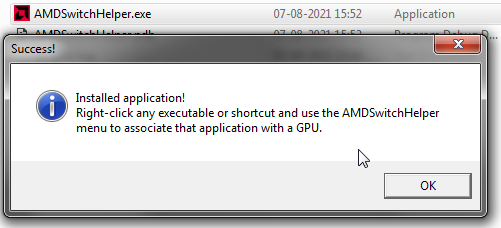
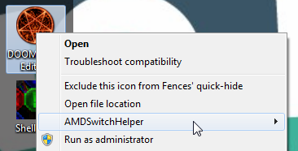
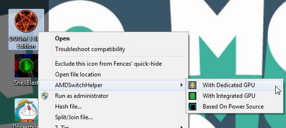
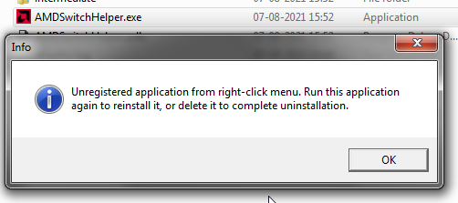

# AMDSwitchHelper

A simple helper app that lets you directly assign an application to a specific GPU on systems with AMD Switchable Graphics (Intel+AMD GPU) After install, this application registers a shortcut for when you right click a compatible item (ie: a shortcut to an executable, or the executable itself), and lets you manually specify whether the application should run on the integrated or dedicated GPU.
Compatible with Win7/Win8/Win10 64-bit systems equipped with PowerXpress AMD Switchable graphics (Radeon 3xxx/4xxx/5xxx/6xxx/7xxx/8xxx/Rxxx generation hardware with integrated Intel graphics and mux capabilities)

## How To Use

After download, simply double click the executable to install. The app will register the shortcut:

Then, right-click any compatible shortcut or executable, and you should see the AMDSwitchHelper submenu:

From there, select your preferred option - run on dedicated GPU, integrated GPU, or dynamically, according to the power settings:

That's it - the next time you run the application, it should automatically select the specified GPU! To uninstall, simply double click the executable again, and it will remove the app submenu from the right-click menu:

